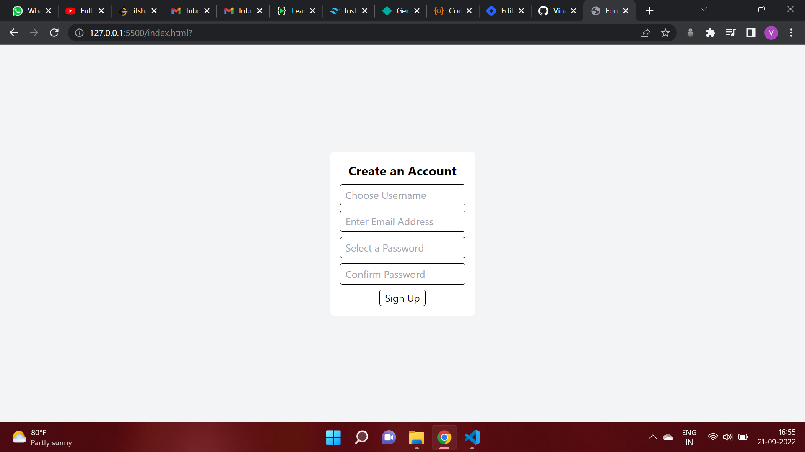

# **Form Validation Using JS**
## **Overview**
This is a simple form validation app in which a user want to create an account and is filling his details like "username", "password", "email" to create the account. 
This app will automatically checks the username valid length, password and confirm password matched or not, email is valid or not.

## **Technology Used**
1. HTML
2. Tailwind CSS
3. JavaScript

## **Output**

## **Live Link**
